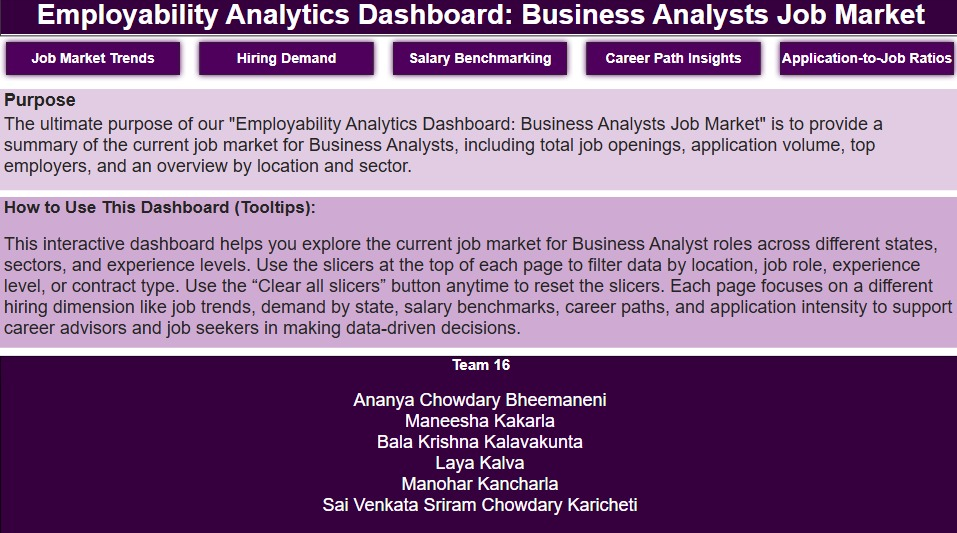
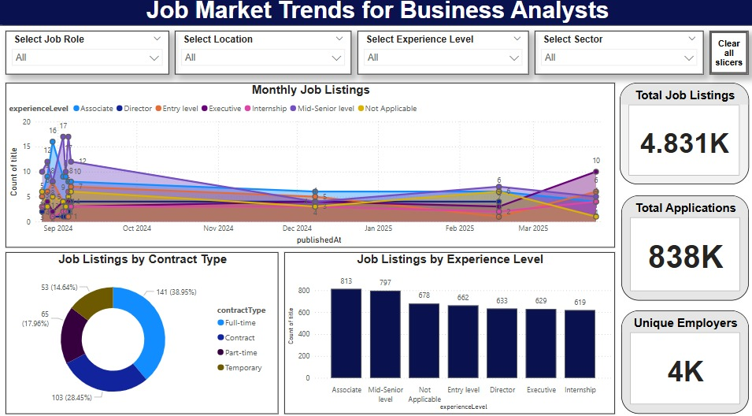
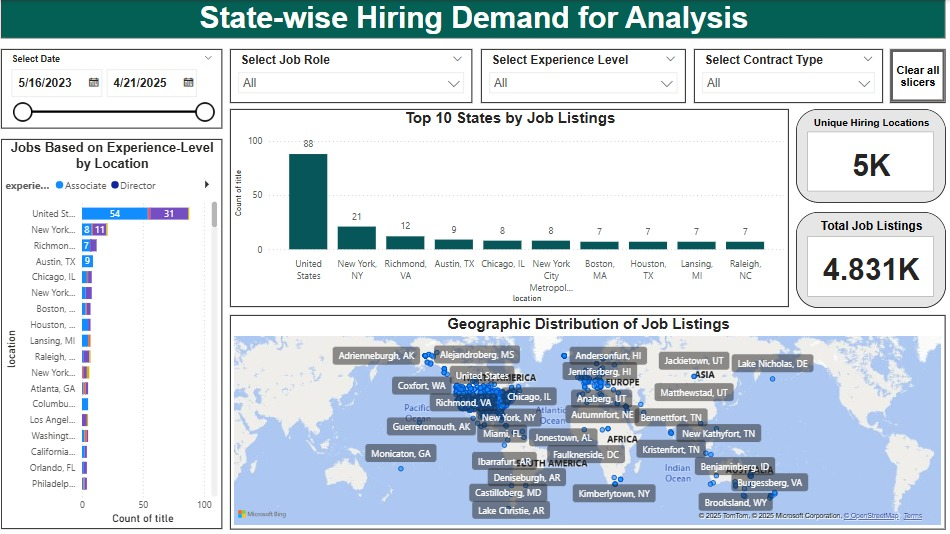
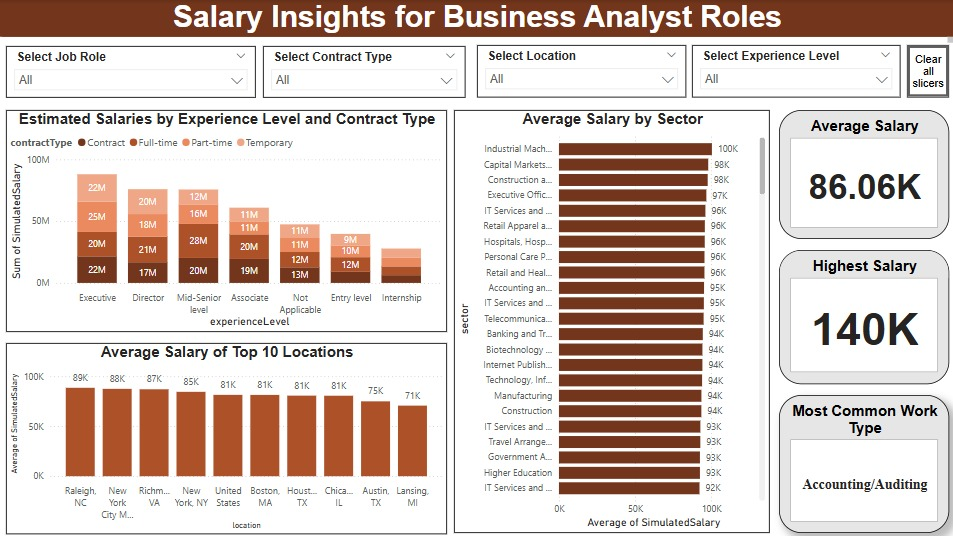
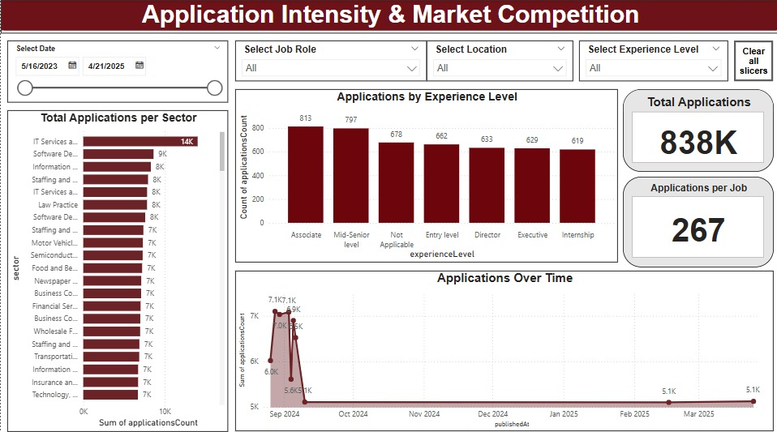

# 📊 Employability Analytics Dashboard  
Empowering career advisors with real-time labor market insights for Business Analyst roles across the U.S.

---

## 📘 Project Description

This Power BI dashboard offers career advisors and job seekers a comprehensive overview of the Business Analyst job market in the United States. By combining real-time filters, interactive visualizations, and data from LinkedIn and Kaggle (cleaned using Python), this dashboard delivers actionable insights into:

- 📈 Job market fluctuations  
- 💰 Salary trends by role, region, and experience  
- 📍 Regional hiring demand  
- 🎯 Career path trajectories  
- 🔥 Market competition and application trends  

Our goal is to support data-driven decision-making for both advisors and candidates seeking employment in the Business Analyst field.

---

## 📚 Table of Contents

- [Usage](#️usage)
- [Features](#features)
- [Dashboard Preview](#dashboard-preview)
- [Project Structure](#project-structure)
- [Acknowledgements](#acknowledgements)
- [Installation](#installation)
- [Contributing](#contributing)

---

## 🛠️ Usage

1. Open **Power BI Desktop**  
2. Load the `Team16.pbix` file  
3. Use slicers to filter by:
   - Location  
   - Experience level  
   - Job Role  
   - Contract Type  
4. Hover over tooltips for insights  
5. Use the “Clear All Slicers” button to reset filters anytime  

---

## 🌟 Features

- 📈 Visual breakdown of job market trends over time  
- 💰 Salary benchmarking by location, experience, and contract type  
- 🌍 Geographic mapping of hiring demand  
- 🔥 Application intensity and competition ratios  
- 🧭 Career path and work type breakdown  
- 🎯 Real-time slicing and dashboard interactivity  

---

## 🖼️ Dashboard Preview

### 📍 Overview Page  


### 📈 Job Market Trends  


### 🏙️ State-wise Hiring Demand  


### 💰 Salary Benchmarking  


### 🔥 Application Intensity & Market Competition  


### 🧭 Career Path & Work Type Breakdown  


---

## 📁 Project Structure

employability-analytics/
├── Team16.pbix
├── README.md
├── overview.jpeg
├── jobmarket.jpeg
├── hiring.jpeg
├── salary.jpeg
├── applicationintensity.jpeg
├── career.jpeg
├── data/
│   └── team16_Dataset.xlsx


---

## 🙌 Acknowledgements

This project was made possible through collaborative effort and guidance from:

- 💼 [Power BI](https://powerbi.microsoft.com/)
- 📊 Kaggle & LinkedIn job datasets  
- 🐍 Python (Pandas) for data preprocessing  
- 👥 Team 16 – IS-5960-04 @ Saint Louis University:
  - Ananya Chowdary Bheemaneni  
  - Maneesha Kakarla  
  - Bala Krishna Kalavakunta  
  - Laya Kalva  
  - Manohar Kancharla  
  - Sai Venkata Sriram Chowdary Karicheti  
- 👩‍🏫 Professor Maria Weber for her continuous guidance and feedback  

---

## 💻 Installation

> You need [Power BI Desktop](https://powerbi.microsoft.com/desktop/) to open and interact with the `.pbix` dashboard file.

```bash
git clone https://github.com/ananyachowdary/employability-analytics.git
cd employability-analytics
