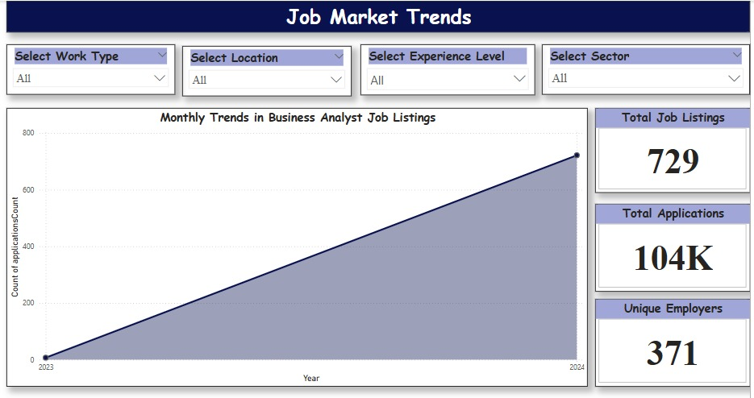
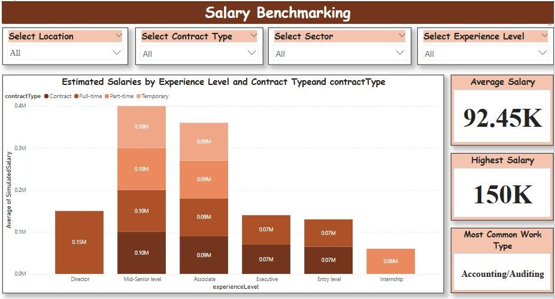

# Employability Analytics Dashboard  
Empowering career advisors with real-time labor market insights for Business Analyst roles across the U.S.

---

## Project Description

This project aims to optimize career advisory services by providing data-driven insights into the Business Analyst job market. Our dashboard helps career advisors analyze:

- 📈 Job market trends  
- 💰 Salary benchmarks  
- 🔥 Candidate interest across locations  
- 🧭 Career path preferences  
- 🏢 Employer demand  

Using data sourced from LinkedIn and cleaned with Python, the dashboard provides real-time visualizations to support advisors in making accurate, personalized, and informed recommendations for job seekers.

---

## Table of Contents

- [Usage](#usage)
- [Features](#features)
- [Dashboard Preview](#dashboard-preview)
- [Project Structure](#project-structure)
- [Acknowledgements](#acknowledgements)
- [Contributing](#contributing)
- [Installation](#installation)
---

## Usage

Open Power BI Desktop
Load the file Team16.pbix
Use slicers and filters to explore:
Location
Experience level
Contract type
Job type
Interact with visualizations and hover over tooltips
Reset filters using the built-in reset button

## Features

- 📈 Job market trend visualization  
- 💰 Salary benchmarking  
- 🔥 Candidate interest heatmap  
- 🧭 Career path distribution  
- 🏢 Employer demand overview  
- 🎯 Real-time filtering with slicers


## Dashboard Preview

### 📈 Job Market Trends  


### 💰 Salary Benchmarking  


### 🔥 Candidate Interest  


### 🧭 Career Path Distribution  


### 🏢 Employer Demand  


## Project Structure

employability-analytics/├── Team16.pbix
                        ├── README.md 
                        ├── Jobmarkettrends.jpeg 
                        ├── Salarybenchmarking.jpeg 
                        ├── candidate_interest.jpeg 
                        ├── career_path.jpeg 
                        ├── employer_demand.jpeg 
                        ├── data/ 
                        │ └── CLEANED_Business_analyst_job_listings.csv

## Acknowledgements

Power BI
Kaggle & LinkedIn job datasets
Python (Pandas) for data preprocessing
Team 16 – IS-5960-04 @ Saint Louis University:
Ananya Chowdary Bheemaneni
Maneesha Kakarla
Bala Krishna Kalavakunta
Laya Kalva
Manohar Kancharla
Sai Venkata Sriram Chowdary Karicheti
Professor Maria Weber

## Contributing

Pull requests are welcome.  
For major changes, please open an issue first to discuss what you'd like to change.

To contribute:
```bash
fork → clone → branch → commit → push → pull request


## Installation

> You need [Power BI Desktop](https://powerbi.microsoft.com/desktop/) to open and interact with the dashboard.

1. Clone the repository:
```bash
git clone https://github.com/ananyachowdary/employability-analytics.git
cd employability-analytics


